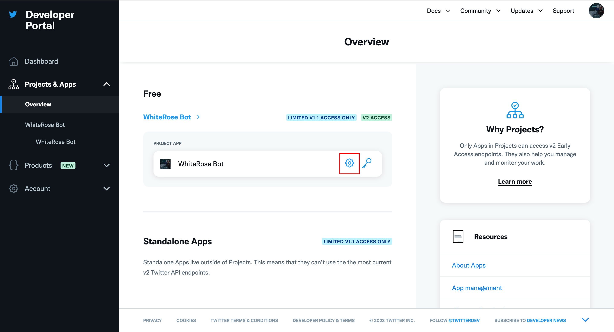
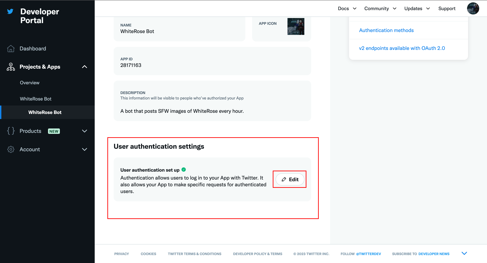
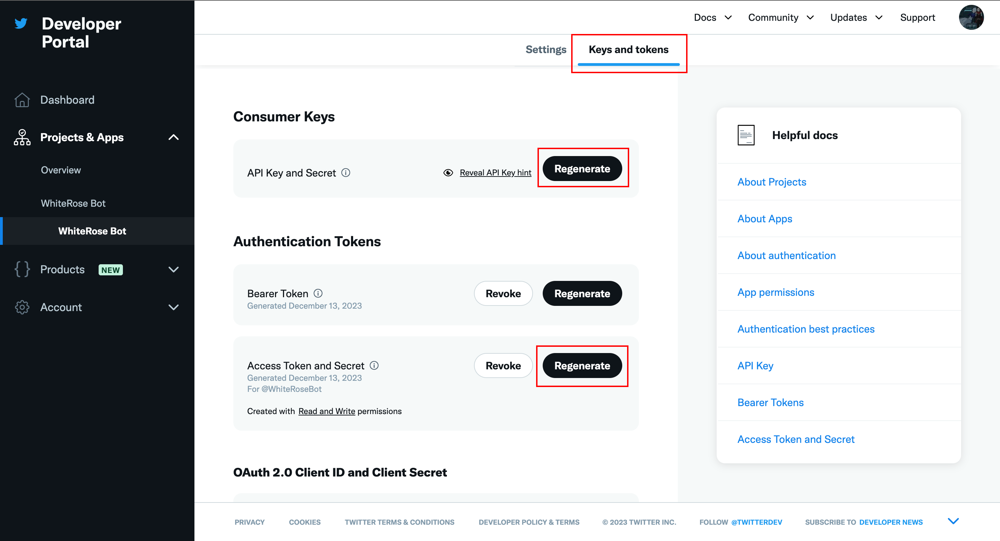
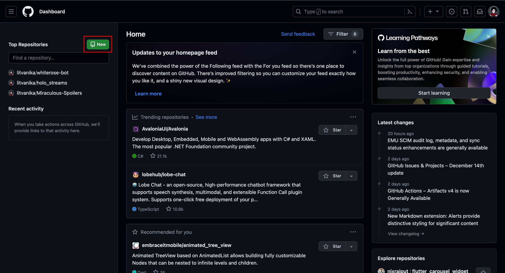
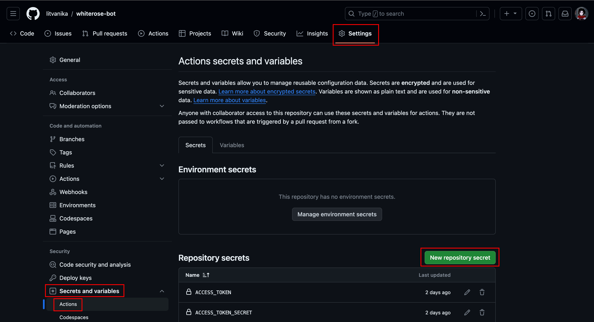

# WhiteRose Bot {#whiterose-bot}


A simple Twitter bot that posts SFW images of WhiteRose every hour.

It is based on [this repository](https://github.com/patrickloeber/python-github-action-template/tree/main).

Was automated by [Github Actions](https://github.com/features/actions) but it's slow so I switched to https://cron-job.org.

If you wish to submit WhiteRose images, please fill in [this form](https://docs.google.com/forms/d/e/1FAIpQLSc8EdW-0LNfdTPTsb5KNzDhRewnvEw2Dbz5FB4SgDU49KTcpg/viewform?usp=sf_link).


<br>


# How to make an hourly Twitter (X) bot (with images) for free. Tutorial: {#tutorial}

This tutorial is about how to create a Twitter bot that tweets random images/videos that you have provided to it.

The following formats are supported: `jpg`, `jpeg`, `png`, `gif`, `mp4`.

## Table of contents

1. [Step 1](#step-1)
2. [Step 2](#step-2)
3. [Step 3](#step-3)
4. [Step 4](#step-4)
5. [Step 5](#step-5)
6. [Step 6](#step-6)
7. [Step 7](#step-7)
8. [Step 8](#step-8)
9. [Step 9](#step-9)
10. [Step 10](#step-10)
11. [Step 11](#step-11)
12. [Step 12](#step-12)
13. [Step 13](#step-13)
14. [Step 14](#step-14)


## Step 1. Create a new Twitter account for your bot {#step-1}

If you aren't going to send automated hourly tweets on your main account, then you'll need to create a new account for your bot.

## Step 2. Get developer access {#step-2}

Go to https://developer.twitter.com/ and click get started under the `Free` column under the `Find the right access for you` section.

When asked what you need access to Twitter API for, describe your bot and write what it will and won't do. I'll have to type at least 250 characters, so no need to hide anything.

For example (257 characters):

> A <> bot that post images/tweets of <> on X (Twitter) every hour. The bot doesn't retweet, like, quote, follow, add to lists, or interact with X (Twitter) users in other ways. If this happens, it's the owner of the bot who is doing that, not the bot itself.

Such bots as the one in this tutorial are fully legal, but if you need more information on what you can and can't do, here are the the links:
- [Developer policy](https://developer.twitter.com/en/support/x-api/policy)
- [Automation rules](https://help.twitter.com/en/rules-and-policies/x-automation)

## Step 3. Add automated label to your bot account {#step-3}

Even though the bot will work without the `automated` label, Twitter [requires](https://help.twitter.com/en/using-x/automated-account-labels#:~:text=Our%20Automation%20rules%20require%20these%20accounts%20to%20display%20labels%20and%20remain%20connected%20to%20a%20human%2Drun%20account.) bots to have such a label on their profiles. Click [here](https://developer.twitter.com/en/docs/apps/overview#:~:text=Automated%20Account%20labeling%20for%20bots) to see how you can add one.

## Step 4. Edit authentication settings {#step-4}

Go to https://developer.twitter.com/en/portal/projects-and-apps and click on `settings` icon near your newly created app's title.


There you'll need to scroll down and setup `User authentication settings`. For you the button is probably not `Edit`, but rather `Create` or `Set up`, but if it leads you to user authentication settings (it probably does), click on it.


In the new page you'll need to check the following:

| Setting | Value |
| --- | --- |
| App permissions | Read and write |
| Type of App | Web App, Automated App or Bot |
| Callback URI / Redirect URL & Website URL | https://google.com/ (basically any link will work, I typed the link to my bot's Twitter account (https://twitter.com/WhiteRoseBot) |

Click `Save` at the bottom of the page.

## Step 5. Generate secret keys {#step-5}

Go to `Keys and tokens` and click `generate` or `regenerate` `API Key and Secret`and `Access Token and Secret` keys. When asked to save them locally, save them locally on your computer - these keys are secret and will not be shown to you again. These keys we'll be used later.


## Step 6. Collect images {#step-6}

In this tutorial we tweet random images and videos, so you'll need to collect them first.

First, if you haven't already, create a folder somewhere on your computer that will contain all your files for your Twitter bot. In this tutorial we will call this folder the `twitter_bot` folder

Once you have collected the required images, create a new folder inside the `twitter_bot` folder called `assets` and put the collected images in there.

## Step 7. Set up python {#step-7}

If you don't have python on your computer, download it from [here](https://www.python.org/downloads/). In this tutorial I'm using python 3.11.4.

Create a `requirements.txt` inside your `twitter_bot` folder and insert in there these 2 lines:

```
requests==2.31.0
tweepy==4.14.0
```

Then open `Command Line` (`cmd.exe`) on [Windows](https://www.youtube.com/watch?v=bgSSJQolR0E) or `Terminal` on [macos](https://www.youtube.com/watch?v=aj9QWELAv9o)/linux from the `twitter_bot` folder and type the following line:

```
pip install -r requirements.txt
```

and press Enter - this will install the required python packages.

## Step 8. Write python script {#step-8}

Inside the `twitter_bot` folder create a new python file named `main.py` and put the following code in there:

```python
import os
import random
import requests
import tweepy


# Pick a random image/video from the 'assets' folder
def get_random_media():
    path = 'assets' # 
    objects = os.listdir(path)

    media = random.choice(objects)
    return os.path.join(path, media)


# Authorize Twitter with v1.1 API
def auth_v1(consumer_key, consumer_secret, access_token, access_token_secret):
    auth = tweepy.OAuthHandler(consumer_key, consumer_secret)
    auth.set_access_token(access_token, access_token_secret)
    return tweepy.API(auth)


# Authorize Twitter with v2 API
def auth_v2(consumer_key, consumer_secret, access_token, access_token_secret):
    return tweepy.Client(
        consumer_key=consumer_key, consumer_secret=consumer_secret,
        access_token=access_token, access_token_secret=access_token_secret,
        return_type=requests.Response,
    )


# Tweet picked image/video
def tweet(media) -> requests.Response:
    # In the next for 4 lines we are getting the keys from Step 4
    consumer_key = os.environ['CONSUMER_KEY']
    consumer_secret = os.environ['CONSUMER_SECRET']
    access_token = os.environ['ACCESS_TOKEN']
    access_token_secret = os.environ['ACCESS_TOKEN_SECRET']

    api_v1 = auth_v1(consumer_key, consumer_secret,
                     access_token, access_token_secret)
    client_v2 = auth_v2(consumer_key, consumer_secret,
                        access_token, access_token_secret)

    media_id = api_v1.media_upload(media).media_id

    return client_v2.create_tweet(media_ids=[media_id])


def main():
    medias = get_random_medias()
    tweet(medias)


if __name__ == '__main__':
    main()

```

## Step 9. Create a repository on Github {#step-9}

First enable showing hidden files on your computer: [click here for Windows](https://support.microsoft.com/en-us/windows/view-hidden-files-and-folders-in-windows-97fbc472-c603-9d90-91d0-1166d1d9f4b5#WindowsVersion=Windows_10) or press `Command` + `Shift` + `.` (dot) in `Finder` on macos.

Now make sure that the secret keys from [Step 4](#step-4) and saved somewhere NOT in the `twitter_bot` folder. The keys are secret and should be available ONLY to you.

Then create a [GitHub](https://github.com) account if you don't have one already.

After that create a new repository:



After creating a repository you'll be presented with its screen. Open `Command Line`/`Terminal` from the `twitter_bot` folder and copy the text from the "…or create a new repository on the command line" on GitHub line-by-line and paste it into the `Command Line`/`Terminal`, except:
- don't insert the first line
- instead of `git add README.md` insert `git add .`"

Now inside the `twitter_bot` folder create a new folder called `.github`, and inside that create another folder called `workflows`, and only inside the `workflows` folder create a file called `actions.yml` with the following contents:

```yml
name: tweet a random image # name can be anything

on:
  workflow_dispatch:

jobs:
  build:
    runs-on: ubuntu-latest
    steps:

      - name: checkout repo content
        uses: actions/checkout@v2 # checkout the repository content to github runner

      - name: setup python
        uses: actions/setup-python@v4
        with:
          python-version: '3.11.4' # or any other python version
          
      - name: install python packages
        run: |
          python -m pip install --upgrade pip
          pip install -r requirements.txt
          
      - name: execute py script # run main.py
        env:
          CONSUMER_KEY: ${{ secrets.CONSUMER_KEY }}
          CONSUMER_SECRET: ${{ secrets.CONSUMER_SECRET }}
          ACCESS_TOKEN: ${{ secrets.ACCESS_TOKEN }}
          ACCESS_TOKEN_SECRET: ${{ secrets.ACCESS_TOKEN_SECRET }}
        run: python main.py
```

## Step 10. Add more images / Update code {#step-10}

If you change the files inside your `twitter_bot` folder, the changes will not be reflected on GitHub and the bot will not see them. To add make GitHub and the bot see the changes, open `Command Line`/`Terminal` from the `twitter_bot` folder and write the following commands:

```
git add .
git commit -m "<Enter your message (without the <brackets>)>"
git push
```

If `git push` displays an error, try the following commands:

```
git pull
git push
```

If `git pull` fails as well, try this:

```
git config pull.rebase true
git pull
git push
```

> **Remember to always follow this Step when you update your images/videos or code!**

## Step 11. Add secret keys to GitHub {#step-11}

Go to your repository's settings page on GitHub and on the sidebar on the left click `Secrets and variables` -> `Actions` -> `New repository secret`:



Now add the keys from [Step 4](#step-4) with the following names:

| Twitter name | GitHub name |
| --- | --- |
| Api Key | CONSUMER_KEY |
| Api Secret | CONSUMER_SECRET |
| Access Token | ACCESS_TOKEN |
| Access Token Secret | ACCESS_TOKEN_SECRET |

Note: if you have lost the keys or accidentally made them public, regenerate them on https://developer.twitter.com/en/portal/dashboard


## Step 12. Test your bot {#step-12}

Go to your twitter bot's repository page on GitHub and click `Actions` in the topbar.

In the sidebar on the left click `tweet a random image` or (whatever name you typed in actions.yml).

Then click the grey `Run worflow` button on the right and then click the green `Run workflow` button.

Wait until the workflow finishes. If it's displaying a green checkmark and you see a newly created tweet on your bot's Twitter account, then congrats, you've written a bot, and now all that's left is to set up a cron job for it.

## Step 13. Create a GitHub token for a cron job {#step-13}

Go to https://github.com/settings/tokens?type=beta and click `Generate your token`.

There you'll need to choose the following settings:

| Setting | Value |
| --- | --- |
| Expiration | Custom (1 year from now) |
| Repository access | Only select repositories (Select the twitter bot repository) |
| Permissions | Repository permission: Actions: Read and write |

Click `Generate token` at the bottom and save it locally just like the Twitter keys as it won't be shown to you ever again.

## Step 14. Create a cron-job {#step-14}

Go to https://cron-job.org/ and create a new account if you don't have one already.

After you create an account, go to https://console.cron-job.org/jobs and click `Create Cronjob`.

In the `Common` tab enter the following text inside the `URL` text box (replacing text inside \<brackets\>):

```
https://api.github.com/repos/<Your username on GitHub>/<Your Twitter bot's repository name>/actions/workflows/actions.yml/dispatches
```

Fill all the other fills in the `Common` tab according to your preferences (I recommend leaving the `Execution schedule` as `Every 60 minutes` as Twitter allows only up to 1500 tweets per month).

Now switch to the `Advanced` tab:

In the `Headers` section type in the following key-value pairs (again replacing text inside \<brackets\>):

| Key | Value |
| --- | --- |
| Accept | application/vnd.github+json |
| X-GitHub-Api-Version | 2022-11-28 |
| Authorization | Bearer <Your GitHub token from Step 11> |

In the `Advanced` section select/enter the following:

| Setting | Value |
| --- | --- |
| Time zone | UTC |
| Request method | POST |
| Request body | {"ref":"main"} |

If you've done everything correctly, your bot should be tweeting every hour!

> **Remember to always follow [Step 10](#step-10) when you update your images/videos or code!**
